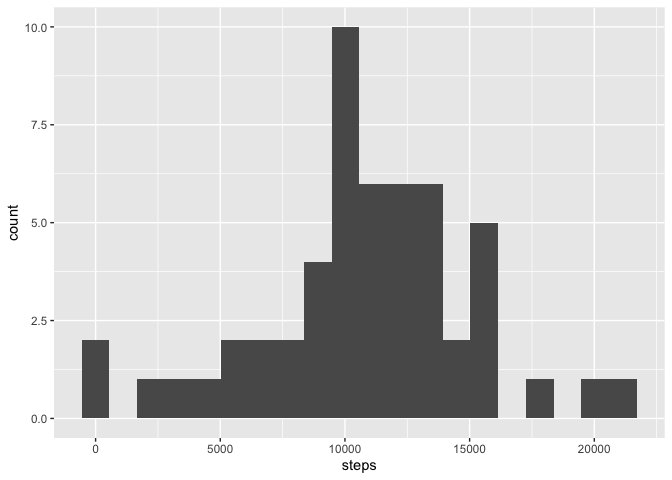
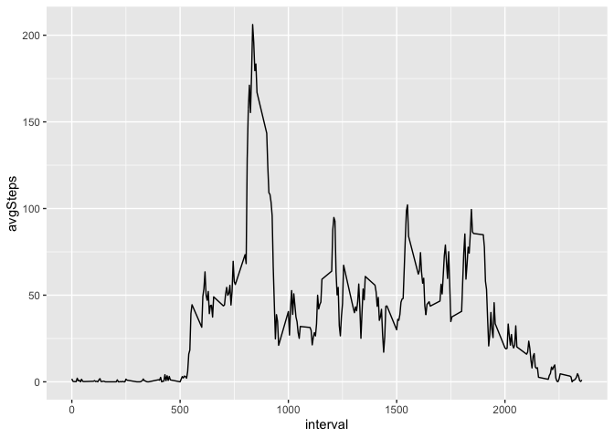
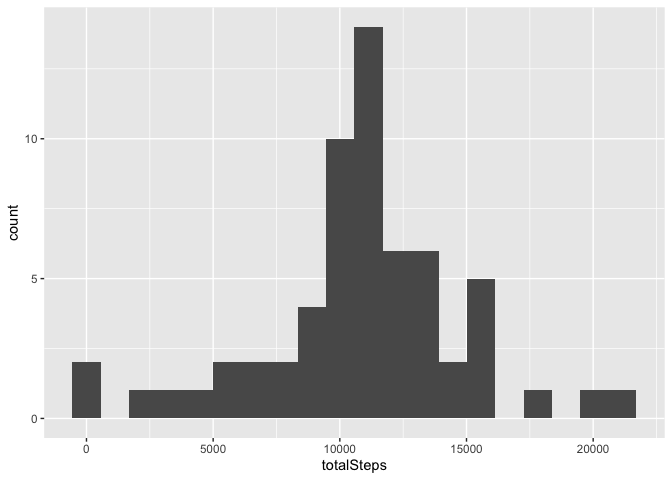
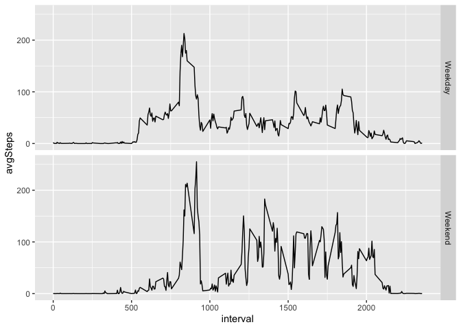

## Loading and preprocessing the data
This code chunk loads the data and a pair of libraries to help with cleaning and
analyzing the data. It then converts the date column from a character vector to 
a date vector.

```r
library(dplyr)
library(lubridate)
library(ggplot2)
unzip("activity.zip")
activity <- read.csv("activity.csv")
activity <- mutate(activity, date = ymd(date))
```

## What is mean total number of steps taken per day?
This first chunk of code uses tapply to find the total amount of steps taken on 
each day, then turns these values into a new dataframe used to create a histogram
of these values.

```r
stepsByDay <- tapply(activity$steps,as.factor(activity$date),sum)
dailySteps <- data.frame(stepsByDay)
dailySteps$date <- ymd(rownames(dailySteps))
dailySteps <- rename(dailySteps,"steps" = stepsByDay) 
ggplot(dailySteps, aes(x = steps)) + geom_histogram(bins = 20)
```

```
## Warning: Removed 8 rows containing non-finite values (stat_bin).
```

<!-- -->

Next, we can use this dataframe to calculate the mean and the median values for
daily steps.

```r
avgDailySteps <- mean(dailySteps$steps,na.rm = T)
paste("Average:",avgDailySteps)
```

```
## [1] "Average: 10766.1886792453"
```

```r
medianDailySteps <- median(dailySteps$steps, na.rm = T)
paste("Median:", medianDailySteps)
```

```
## [1] "Median: 10765"
```


## What is the average daily activity pattern?
This time, instead of using tapply, we use group_by and summarize to find average
values for steps during each 5 minute interval. It then plots that into a line graph.

```r
intervalSteps <- activity %>% group_by(interval) %>%
    summarize(avgSteps = mean(steps, na.rm = T))
```

```
## `summarise()` ungrouping output (override with `.groups` argument)
```

```r
ggplot(intervalSteps, aes(x=interval, y= avgSteps)) + geom_line()
```

<!-- -->

As shown in the graph above, there is a large spike around the 800 interval. We
can dig deeper to find out exactly where this spike occurs by isolating the row
in which the maximum value occurs and retrieving the interval from that row.

```r
maxIndex <- which(intervalSteps$avgSteps == max(intervalSteps$avgSteps))
maxInterval <- intervalSteps$interval[maxIndex]
paste("Max interval:", maxInterval)
```

```
## [1] "Max interval: 835"
```

```r
paste("Max average steps:", round(max(intervalSteps$avgSteps)))
```

```
## [1] "Max average steps: 206"
```

## Imputing missing values
We want to analyze the amount of missing values to figure out if it might be biasing
our results.

```r
sum(is.na(activity$steps))
```

```
## [1] 2304
```

Since 2,304 missing values is a lot, we want a way to fill in these missing values
so we can avoid skewing our data. I decided to fill in the average value from the
given 5 minute interval over the rest of the sample. The code loops through the 
data for steps and checks whether the value is NA. If it is, it replaces it with
the correct value from the dataframe created earlier containing average steps for
each interval. It then creates a histogram from this new data and computes the median
and mean values for each day.

```r
imputedActivity <- activity
for (i in 1:length(imputedActivity$steps)) {
    if (is.na(imputedActivity$steps[i])) {
        int <- imputedActivity$interval[i]
        index <- which(intervalSteps$interval == int)
        imputedActivity$steps[i] <- intervalSteps$avgSteps[index]
    }
}

imputedDailySteps <- imputedActivity %>% group_by(date) %>%
    summarize(totalSteps = sum(steps))
```

```
## `summarise()` ungrouping output (override with `.groups` argument)
```

```r
ggplot(imputedDailySteps, aes(x=totalSteps)) + geom_histogram(bins = 20)
```

<!-- -->

```r
imputedAvgSteps <- mean(imputedDailySteps$totalSteps)
paste("Average Imputed Steps:", imputedAvgSteps)
```

```
## [1] "Average Imputed Steps: 10766.1886792453"
```

```r
paste("Previous Average Steps:", avgDailySteps)
```

```
## [1] "Previous Average Steps: 10766.1886792453"
```

```r
imputedMedSteps <- median(imputedDailySteps$totalSteps)
paste("Median Imputed Steps:", imputedMedSteps)
```

```
## [1] "Median Imputed Steps: 10766.1886792453"
```

```r
paste("Previous Median Steps", medianDailySteps)
```

```
## [1] "Previous Median Steps 10765"
```

As can be seen above, the average daily value does not change after imputing these
values, which implies that the NAs come evenly from every interval. This might
mean that certain days have no values whatsoever, and the rest have complete sets
of data. The median value, meanwhile, changes very slightly to exactly mirror the
mean, reflecting the fact that days with NAs will all have the mean value, and thus
the median is likely to equal this repeated value if the data is not badly skewed.

## Are there differences in activity patterns between weekdays and weekends?
This code creates a factor variable indicating whether a date falls on a weekday
or weekend, and then creates a dataset with steps summarized by interval and 
whether the date is a weekend or not. It then puts this data into a faceted
line graph.

```r
saturdaysIndex <- which(weekdays(imputedActivity$date) == "Saturday")
sundaysIndex <- which(weekdays(imputedActivity$date) == "Saturday")
weekendIndex <- c(saturdaysIndex, sundaysIndex)
imputedActivity$weekend <- NA
imputedActivity$weekend[weekendIndex] <- "Weekend"
imputedActivity$weekend[-(weekendIndex)] <- "Weekday"
imputedActivity$weekend <- as.factor(imputedActivity$weekend)

intervalSteps2 <- imputedActivity %>% group_by(interval, weekend) %>%
    summarize(avgSteps = mean(steps))
```

```
## `summarise()` regrouping output by 'interval' (override with `.groups` argument)
```

```r
ggplot(intervalSteps2, aes(x=interval,avgSteps)) + geom_line() + facet_grid(weekend~.)
```

<!-- -->

Weekend steps seem to begin to rise a little later and to stay higher throughout the middle of the day.
